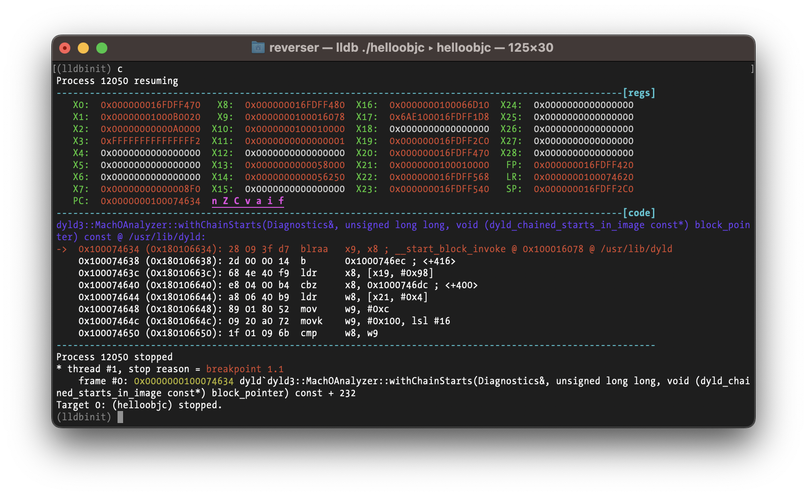
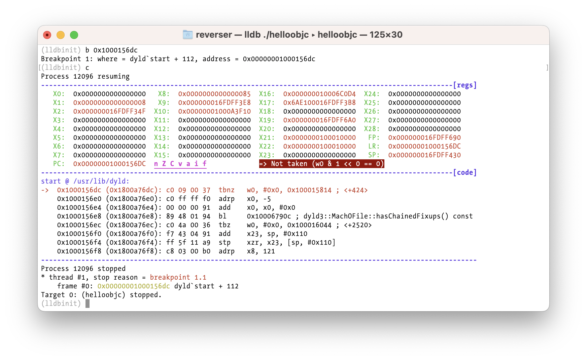

<p align="center">
  
</p>

### About

A gdbinit clone for LLDB aka how to make LLDB a bit more useful and less crappy.

https://github.com/gdbinit/lldbinit

Original lldbinit code by Deroko @ https://github.com/deroko/lldbinit  
gdbinit available @ https://github.com/gdbinit/Gdbinit

(c) Deroko 2014, 2015, 2016  
(c) fG! 2017-2023 - reverser@put.as - https://reverse.put.as

No original license by Deroko.

All my modifications are under MIT license.

Huge thanks to Deroko for his original effort! Without it this would not exist.

Most of gdbinit functions are converted, and a bunch of new functions added.  
Some of the commands that were passed to lldb command line were converted to internal API.

While it's almost 5k lines of text and a bit annoying to manage and edit, I don't intend to modularize this version because I like to just copy a single file where I need it. Extra features could be added as plugins (for example [lisa.py](https://github.com/ant4g0nist/lisa.py/tree/dev/resources/archs) databases of x86 and ARM instructions).

Intel syntax is used for x86. Switching to AT&T (yuk!) is a configurable option.

### Forks and other lldbinit scripts

Peter Nguyen maintains a [forked version](https://github.com/peternguyen93/lldbinit) with other features and improvements. Requires Python 3.x.

[lisa.py](https://github.com/ant4g0nist/lisa.py) is also another good contender although focused on exploit dev.

### What's new in version 3.x

* Full arm64 (AArch64) support for most commands and displays.

* Add new `bm` command to break when specific images/modules are loaded. Super useful to break on dynamic libraries for malware analysis and other reversing tasks. This could be done manually with stop on shared library events setting but this command automates and simplifies the process.

* Cleaned up, simplified, improved and updated code.

* Bug fixes.

* Small changes and improvements to UI.

* Dark theme support. Not really a dark theme for now other than fixing basic colors to look ok. Pull requests?

### The future

* Add the remaining features I want.

* Test suite would be a nice to have.

* Keep improving code (Python not my cup of tea).

* Import/add useful features from other scripts.

### Support & Requirements

Supports x86_64, i386, and arm64 targets. The i386 target as long been deprecated in macOS but supporting for now isn't a lot extra work and I hate when tools don't work when you need them (such as reversing old malware or cracking old stuff).

Tested with Xcode 9.4.1, 10.x, 12.x, 14.x (x86_64 and arm64). Python 2.x and 3.x compatible.

Optional Keystone Engine (https://www.keystone-engine.org) can be installed for assembler support.

### How to install

```
cp lldbinit.py ~
echo "command script import  ~/lldbinit.py" >>~/.lldbinit
```

or

just copy it somewhere and use `command script import path_to_script` when you want to load it.

### How to use

List all implemented commands with 'lldbinitcmds'.

### Configuration

There are some user configurable options in the header. You can also use the enable/disable commands to dynamically configure some options.

### Features

* Display the destination of (indirect) calls, jmps, returns, and also Objective-C class and selectors.

<p align="center">
  
</p>

* Display the result of conditional jumps and instructions.

<p align="center">
  
</p>

<p align="center">
  
</p>


### Helpful commands and shortcuts

The `bpm` command allows to set a breakpoint when a specific module (library/framework) is loaded.

The `stepo` command alows to step over branches and calls (they are still executed) so you can easily trace one function without stepping into any calls or branches it might have.

The `skip` command allows you to skip exactly one instruction to next instruction (ignoring control flow!).

The `bpn` command breakpoints the next instruction (ignoring control flow!). It's useful to get out of a loop (when you are at the loop conditional jump tester and you breakpoint the next instruction to let the loop execute without stepping every iteration).

The crack family of commands allow you to automate return from functions with a value and skip code (for all your cracking isRegistered: and malware reversing needs) or breakpoint an address and set a given register to a value (also for all your cracking needs).

You can set the value of any register using its name, which is basically a shortcut for `register write` LLDB command.

The data window allows you to display the data of a certain memory location that you set with `datawin` command. Useful if you want to observe the contents of a string decryption routine for example.
