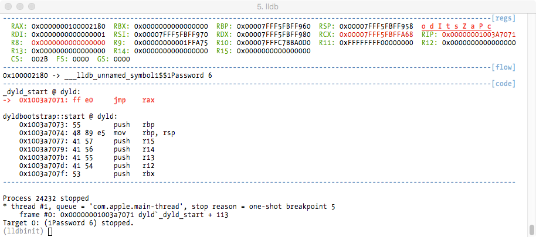
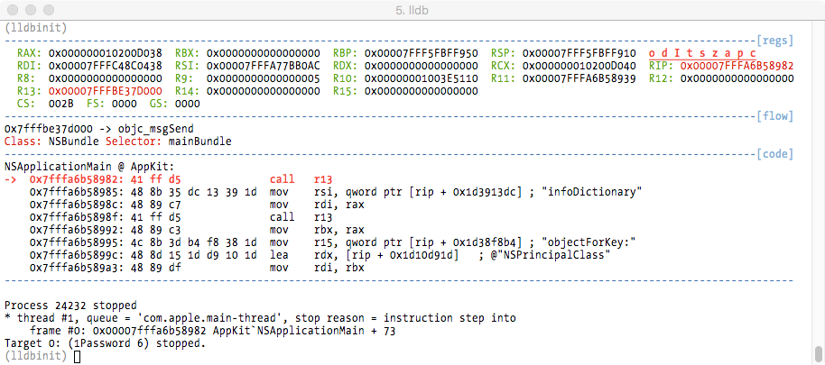

# LLDBINIT

A gdbinit clone for LLDB aka how to make LLDB a bit more useful and less crappy

(c) Deroko 2014, 2015, 2016  
(c) fG! 2017, 2018 - reverser@put.as - https://reverse.put.as

https://github.com/gdbinit/lldbinit

No original license by Deroko so I guess this is do whatever you want with this
as long you keep original credits and sources references.

Original lldbinit code by Deroko @ https://github.com/deroko/lldbinit  
gdbinit available @ https://github.com/gdbinit/Gdbinit

Huge thanks to Deroko for his original effort! Without it this would not exist.

Most of gdbinit functions are converted, and a bunch of new functions added.  
Some of the commands that were passed to lldb command line were converted to internal API.

### Requirements

Tested with lldb out of Xcode 9.2, should work with older versions (but not that old).  
Optional Keystone Engine (https://www.keystone-engine.org) for assembler support.

### How to install

```
cp lldbinit.py ~
echo "command script import  ~/lldbinit.py" >>~/.lldbinit
```

or

```
cp lldbinit.py /Library/Python/2.7/site-packages
echo "command script import lldbinit" >>~/.lldbinit
```

or

just copy it somewhere and use **command script import path_to_script** when you want to load it.

### How to use

List all implemented commands with 'lldbinitcmds'

### Configuration

There are some user configurable options on the header. You can also use the enable/disable commands to real time configure some options.

### Features

The flow window shows the destination of calls, jmps, and returns, and also the class and selectors for Objective-C calls.



----



The crack family of commands allow you to automate return from functions with a value and skip code (for all your cracking isRegistered: and malware reversing needs) or breakpoint an address and set a given register to a value (also for all your cracking needs).

You can set the value of any register using its name, which is basically a shortcut for **register write** LLDB command.

The data window allows you to display the data of a certain memory location that you set with **datawin** command. Useful if you want to observe the contents of a string decryption routine for example.

The **skip** command allows you to skip exactly one instruction to next instruction (ignoring control flow!).

The **bpn** command breakpoints the next instruction (ignoring control flow!). It's useful to get out of a loop (when you are at the loop conditional jump tester and you breakpoint the next instruction to let the loop execute without stepping every iteration).

